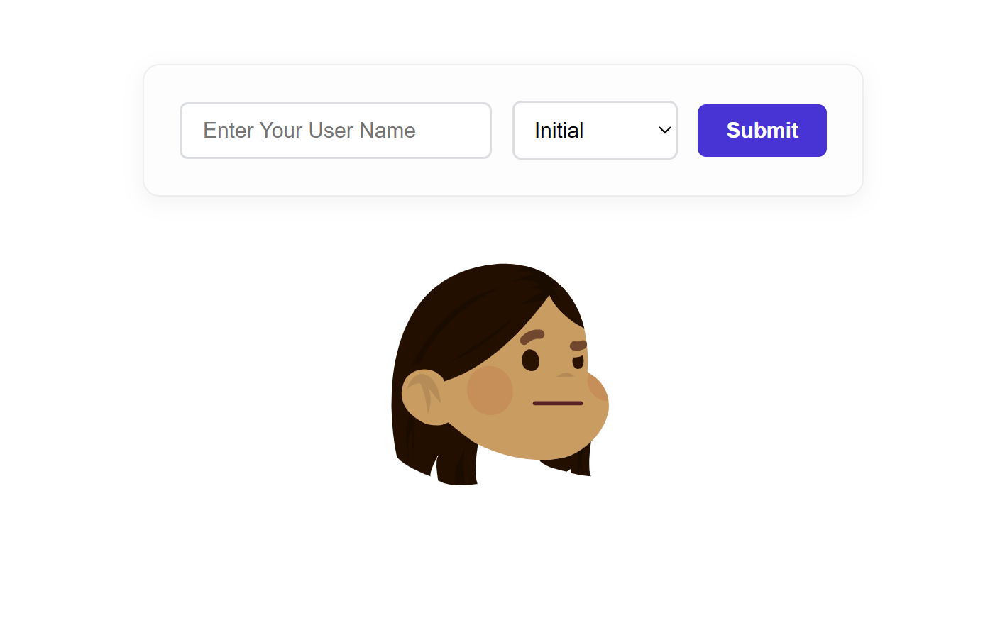

# Dynamic Avatar Generator

A lightweight PHP application that integrates with the DiceBear API to generate dynamic, personalized SVG avatars based on user input and selected style categories.

## Key Features
- Dynamic avatar rendering driven by form inputs.
- Multi-style selection support via custom dropdown parameters.
- Server-side data handling using PHP superglobals.
- Styled user interface built with clean inline CSS for instant deployment.

## Tech Stack
- **Server-side:** PHP
- **Client-side:** HTML5, CSS3
- **External Service:** DiceBear API

## Local Development Setup
1. Clone or download this repository.
2. Move the project folder into your local server root directory (e.g., `C:/xampp/htdocs/avatar-generator`).
3. Launch Apache via your local environment manager (such as XAMPP).
4. Access the application in your browser at `http://localhost/avatar-generator/`.

## Application Preview

